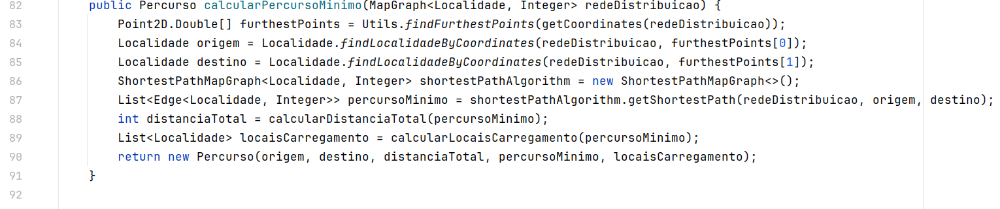
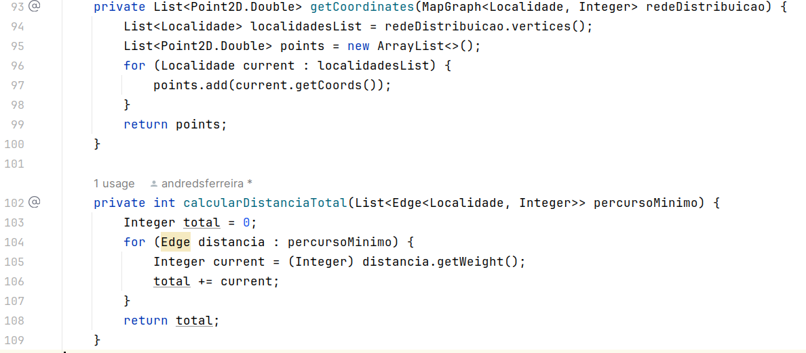
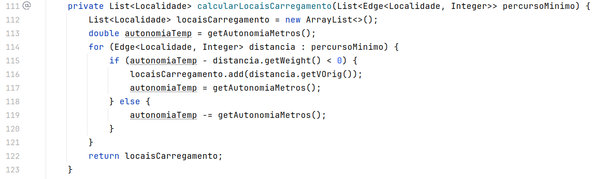

## 1. Método Principal

O método principal usado para a resolução desta us é o calcularPercursoMinimo.
Devolve um objeto Percurso associado ao veículo que contêm as informações pedidas
no enunciado relativamente ao percurso minimo, nomeadamente: a origem, o destino, a
distância total, as distâncias individuais, os locais de carregamento, e o número de
carregamentos.

O método recebe como parâmetros a rede de distribuição como um MapGraph de Localidade
e Integer.

### 1.1. Execução do algoritmo
* Linha 83 - Calcula os pontos mais afastados da rede de distribuição e retorna num array de tamanho 2.
* Linha 84 - Encontra a localidade do ponto origem.
* Linha 85 - Encontra a localidade do ponto destino.
* Linha 86 - Inicia uma instância do algoritmo que calcula o caminho mais curto.
* Linha 87 - Inicia e preenche uma lista das distâncias do caminho mais curto chamando
o algoritmo a partir da instância iniciada na linha anterior e passando como parâmetros os mesmos
do método.
* Linha 88 - Chama um método auxiliar para calcular a distância total do percurso.
* Linha 89 - Chama um método auxiliar para calcular os locais de carregamento durante o percurso.
* Linha 90 - Retorna uma instância Percurso com os fields preenchidos.

## 2. Métodos auxiliares

## 3. Análise de complexidade

Os métodos auxiliares têm todos uma complexidade linear para o pior caso. No melhor caso, têm complexidade constante, mas isto significará que o veículo não saiu do sitio.
A análise é relativamente simples. Para o método calcularDistanciaTotal, recebemos uma lista com as distâncias do percurso mínimo
e percorremo-la o que dita a complexidade linear. Para o método calcularLocaisCarregamente, recebemos a mesma lista e calculamos os locais
de carregamento pelo que apresenta também complexidade linear.

A complexidade do algoritmo para calcular o percurso mínimo, uma vez que utiliza o algoritmo de
Dijkstra, é quadrática. Sendo que depende do número de vértices do grafo da rede de distribuição, isto é,
do número de localidades.

Concluindo, o método apresenta uma complexidade de n elevado a 5.