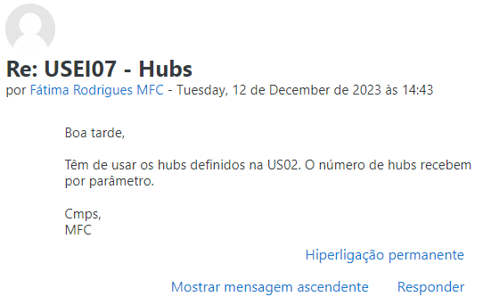

# Testes unitários para a USEI07

Neste ficheiro, vamos visualizar os testes que foram realizados para a funcionalidade pedida na USEI07, analizando cada classe testada.
* USEI07MaximizarNumHubsControllerTest.java

## USEI07MaximizarNumHubsControllerTest.java

Os testes desta classe têm como objetivo verificar que o percurso calculado tem os dados esperados.

```java
@Test
void assertThatSmallGraphPercurso1HasCorrectValues() throws FileNotFoundException {
    LerHorariosController.lerHorariosDeLocalidades(grafoSmall, horariosSmall);
    PercursoHubs percurso = USEI07MaximizarNumHubsController.obterPercursoComMaxNumHubs(grafoSmall,5,
        LocalTime.parse("10:15"), Utils.getLocalidadeById("CT1", grafoSmall.vertices()),
        new Veiculo(1000000, 240, 15, 10));
    assertEquals(percurso.getLocalFinal(), Utils.getLocalidadeById("CT8", grafoSmall.vertices()));
    assertEquals(percurso.getHoraFinal(), LocalTime.parse("13:12"));
    assertEquals(percurso.getTempoTotalDeViagem(), 137);
    assertEquals(percurso.getTempoTotalDeCarregamento(), 40);
    assertEquals(obterRatioDeHubsDentroDoPercurso(percurso, grafoSmall.vertices()), (float)4/5);
}
```
```java
@Test
void assertThatSmallGraphPercurso2HasCorrectValues() throws FileNotFoundException {
    LerHorariosController.lerHorariosDeLocalidades(grafoSmall, horariosSmall);
    PercursoHubs percurso = USEI07MaximizarNumHubsController.obterPercursoComMaxNumHubs(grafoSmall,5,
        LocalTime.parse("10:15"), Utils.getLocalidadeById("CT1", grafoSmall.vertices()),
        new Veiculo(500000, 240, 15, 10));
    assertEquals(percurso.getLocalFinal(), Utils.getLocalidadeById("CT8", grafoSmall.vertices()));
    assertEquals(percurso.getHoraFinal(), LocalTime.parse("13:27"));
    assertEquals(percurso.getTempoTotalDeViagem(), 137);
    assertEquals(percurso.getTempoTotalDeCarregamento(), 55);
    assertEquals(obterRatioDeHubsDentroDoPercurso(percurso, grafoSmall.vertices()), (float)4/5);
}
```
```java
@Test
void assertThatBigGraphPercurso1HasCorrectValues() throws FileNotFoundException {
    LerHorariosController.lerHorariosDeLocalidades(grafoBig, horariosBig);
    PercursoHubs percurso = USEI07MaximizarNumHubsController.obterPercursoComMaxNumHubs(grafoBig,10,
            LocalTime.parse("09:30"), Utils.getLocalidadeById("CT4", grafoBig.vertices()),
            new Veiculo(200000, 200, 15, 10));
    assertEquals(percurso.getLocalFinal(), Utils.getLocalidadeById("CT85", grafoBig.vertices()));
    assertEquals(percurso.getHoraFinal(), LocalTime.parse("09:37"));
    assertEquals(percurso.getTempoTotalDeViagem(), 7);
    assertEquals(percurso.getTempoTotalDeCarregamento(), 0);
    assertEquals(obterRatioDeHubsDentroDoPercurso(percurso, grafoBig.vertices()), 0);
}
```
```java
@Test
void assertThatBigGraphPercurso2HasCorrectValues() throws FileNotFoundException {
    LerHorariosController.lerHorariosDeLocalidades(grafoBig, horariosBig);
    PercursoHubs percurso = USEI07MaximizarNumHubsController.obterPercursoComMaxNumHubs(grafoBig,8,
            LocalTime.parse("13:30"), Utils.getLocalidadeById("CT10", grafoBig.vertices()),
            new Veiculo(200000, 200, 15, 10));
    assertEquals(percurso.getLocalFinal(), Utils.getLocalidadeById("CT118", grafoBig.vertices()));
    assertEquals(percurso.getHoraFinal(), LocalTime.parse("14:22"));
    assertEquals(percurso.getTempoTotalDeViagem(), 32);
    assertEquals(percurso.getTempoTotalDeCarregamento(), 20);
    assertEquals(obterRatioDeHubsDentroDoPercurso(percurso, grafoBig.vertices()), (float)2/8);
}
```
O método ***obterRatioDeHubsDentroDoPercurso*** tem como objetivo saber quantos dos hubs totais é que conseguimos alcançar no percurso calculado.

```java
private float obterRatioDeHubsDentroDoPercurso(PercursoHubs percursoHubs, List<Localidade> localidades){
    return (float) Utils.getHubs(percursoHubs.getLocalidadesDoPercurso()).size() / Utils.getHubs(localidades).size();
}
```

O método ***obterPercursoComMaxNumHubs*** do ***USEI07MaximizarNumHubsController*** invoca o método principal da **USEI02**, visto que na seguinte resposta a uma pergunta, foi dito que o método recebe **o número** de *hubs*, não uma lista já feita deles:



Dentro do mesmo método, aceitamos que um veículo pode descarregar num *hub* depois do seu fechamento, desde que tenha chegado lá dentro do seu horário. Logo, só verificamos se a hora de chegada está dentro do horário, não verificamos a mesma coisa para a hora de saída. Esta decisão também foi baseada numa resposta a uma pergunta:

