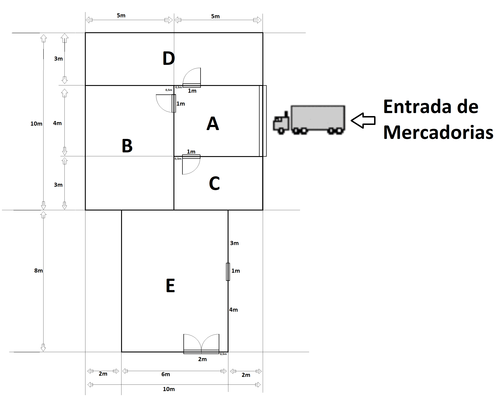

# USFA02: Características Térmicas e Materiais escolhidas

No seguinte documento apresentam-se os materiais utilizados no _Croqui_ previamente mostrado:

**Com a sua seguinte Planta:**
 

**E a sua estrutura Tridimensional:**

**Nota:** Não foram fornecidos quaisquer dados sobre o tipo de estrutura a desenvoler,
no entanto, considerando o âmbito do projeto o grupo considerou a estrutura como um **Celeiro**.

Aqui encontra-se o Material escolhido para a estrutura:
**Material Escolhido*:*

Zona E:

    Telhado : Telha de Barro Vermelho.
    
    Paredes:
             - Exteriores: Granito.

             - Camada Intermédia: Lã de Celulose

             - Interiores: Drywall (gesso acartonado)

    Porta: Porta de Aço
            (Opção B): Porta de madeira

    Janela: (Apenas) Uma camada de vidro com
    caixa de Ar com caixilharia de alumínio termo colada.

        Isolante adicional na Camada Intermédia:
             -Nenhuma

Zona A - D:

    Telhado: Telha Cerâmica.
    (Opção B) Telha Metálica.

    Paredes:
             - Exteriores: Tijolo.

             - Camada Intermédia: Isolamento Térmico Reforçado
               com espuma de poliuretano
               (Opção B) Lã de rocha.

             - Interiores: Drywall (gesso acartonado)

    Porta: Porta Seccional de Alumínio.
            (Opção B) Porta seccional de Aço.

    Janela: Janela PVC
            (Opção B) Dupla camada de vidro com caixa de Ar 
            com caixelharia  de aluminio termocalada.

      

 **Isolamento Adcional na Camada Intermédia:**

Zona A:        
     
    - Nenhum
Zona B:

    - Lã de Rocha        
Zona C:

    - Fibra De Vidro
Zona D:

    - Lã de Celulose 

