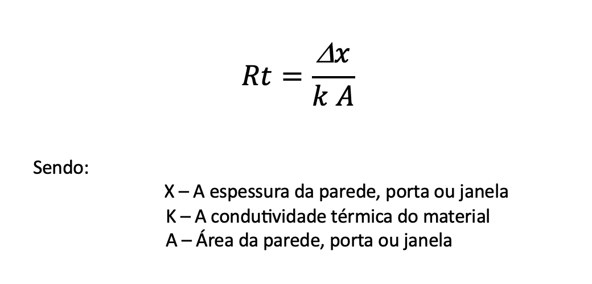
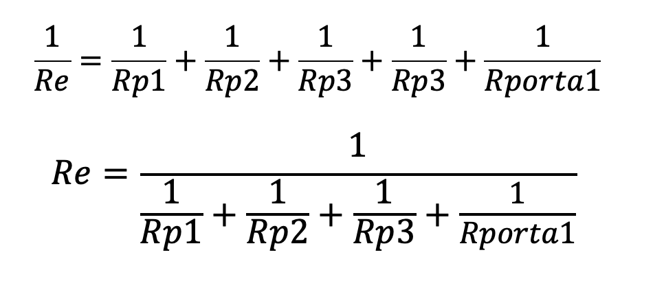

# USFA05 Resistências Térmicas de cada divisão e restante estrutura.

**No seguinte documento apresentam-se respetivamente**:

* O Croqui desenvolvido
* A Planta tridimensional da estrutura

* A Explicação do Cálculo das Resitências para:
  * **Cada Parede**
  * **Cada Porta e Janela**
  * **Total de Cada Divisão**
  * **Restante Estrutura e ambos os telhados**

* Um ficheiro Excel com os resultados obtidos

**Croqui desenvolvido**
 

**E a sua estrutura Tridimensional:**

**Nota:** Não foram fornecidos quaisquer dados sobre o tipo de estrutura a desenvoler,
no entanto, considerando o âmbito do projeto o grupo considerou a estrutura como um **Celeiro**.

# Resitências Térmicas

A resitência Térmica é geralmente calculada pela seguinte forma:

A condutividade térmica é uma constante que indicia a facilidade de quantidade de calor que entra ou sai da estrutura.
Quanto menor a condutividade térmica de uma estrutura menor facilidade terá o calor a entrar.

# Explicação do Cálculo das Resitências em cada Parede:

Cada parede apresenta 3 ou mais materiais na sua constituição conforme os materiais escolhidos nas *USFA02* e *USFA03*.
Para cada parede é calculada individualmente a resistência térmica de cada material dividindo apenas a espessura do material pela sua condutividade, e, por fim somando cada  valor de cada material e  dividindo o agregado pela área da parede.

No caso de uma parede conter uma janela ou uma porta, essas resistências são calculadas separadamente pela fórmula completa com a área não entrando este valor no valor da área  total da parede.
No entanto, a área em uso da parede será a área da parede total menos a área que as respetivas portas(s) ou janela(s) ocupam.

# Explicação do Cálculo das Resistências em cada Divisão
Após obtermos o valor para cada parede, como estas se encontram em paralelo, o inverso da resitência equivalente destas será a soma do inverso de todas elas (com as portas ou janelas caso a divisao as contenha)
Da seguinte forma:

# Explicação do Cálculo da Restante Estrutura e Telhados
A restante estrutura tem a lógica de cálculo idêntico para às paredes e divisões.
Já os telhados, embora sejam independes do resto da estrutura são calculados individualmente pela forma geral da resistência térmica a cima apresentada.

Por fim encontram-se os valores das resistências, para cada material, de cada parede, de cada zona **(B-D)** e as restantes estruturas **(A-E)** com os seus respetivos telhados no seguinte **ficheiro Excel:**

[Ficheiro Excel](../Resitencias-Fluxo-e-Potencia-Térmica.xlsx)

