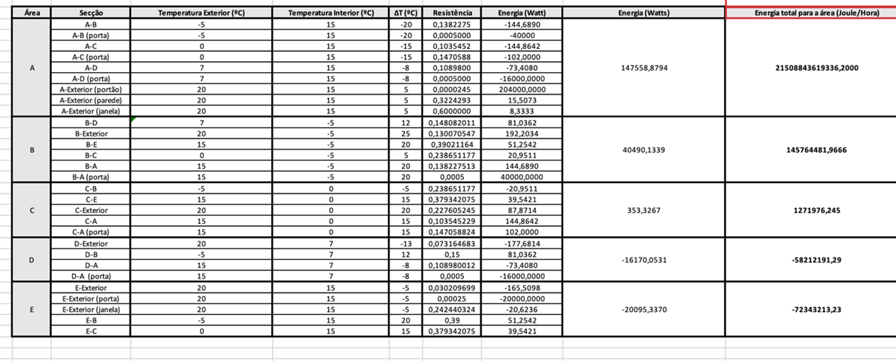

# USFA07 - Calcular energia total a fornecer à estrutura

**No seguinte documento apresentam-se:**
* Explicação da Resolução
* Conclusão

## Explicação da Resolução

Para resolver a primeira parte do problema da US foi utilizada, mais uma vez, a fórmula do fluxo energético com cada constante explicada anteriormente, cada zona contendo a sua diferença de temperatura e a sua resistência: 

Neste caso, tendo **os valores de temperatura** de cada divisão e a temperatura exterior juntamente com a resistência térmica de cada divisão calculada anteriormente na [USFA05](../USFA05/USFA05.md), foi calculada a *quantidade de energia que necessita de passar por hora* para que a estrutura consiga manter a diferença de temperatura, individualmente para cada zona, e depois a total sendo esta a soma de todas as individuais:

Como vemos no excerto de *Excel* em cima, contemos todas as variáveis, e a energia é calculada pela divisão da diferença de temperatura, que por si só é a subtração da coluna da temperatura exterior com a interior, pela resistência da secção específica.

Para cada divisão, temos de calcular a energia das suas várias paredes, portas e janelas diferentes, somando-as.

Desta forma, obtemos o resultado final:

## Conclusão

A variedade de materiais e isolantes utilizados nas Zonas **A** a **E** contribui para diferentes propriedades térmicas em cada zona. A escolha entre as opções oferece flexibilidade de acordo com as necessidades específicas de isolamento e resistência.

Mais detalhes poderão ser vistos no [*Excel* com os cálculos](../Resitencias-Fluxo-e-Potencia-Térmica.xlsx) e no [relatório](../2DJ_G101_FSIAP_Sprint3.pdf) sobre as funcionalidades da nova versão